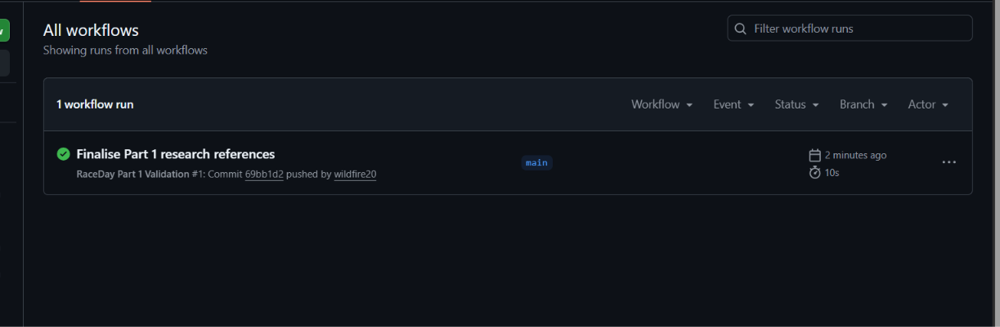

# RaceDay

RaceDay is a web-based event management system for running, walking and cycling events in South Africa.

The idea behind the system is to give Organisers an easier way to manage events, categories, enrolments and race results. Participants will also be able to create accounts, browse events, enter events and keep track of their results.

This project is completed in three parts. Part 1 focuses on planning the system and designing the database before any API code is written.

## Part 1 - System Planning and Database

For Part 1, I planned the structure of RaceDay and created the database that will be used later in the project.

The main work completed in this part includes:

- Entity Relationship Diagram (ERD)
- REST API endpoint plan
- SQL Server database script
- Sample data
- GitHub version control
- GitHub Actions CI/CD workflow
- References

## User Roles

RaceDay has two user roles: Organiser and Participant.

### Organiser

The Organiser is responsible for managing events.

An Organiser will be able to:

- Create events
- Edit and delete events
- Add categories to events
- View Participants who have enrolled
- View the category selected by each Participant
- View enrolment statuses
- Capture finish times
- Capture finishing positions
- Publish race results

### Participant

The Participant is the person taking part in an event.

A Participant will be able to:

- Register for an account
- Log in
- Browse available events
- View event details
- Select an event category
- Enrol in an event
- View their enrolments
- View their results
- View and update their profile information

## Database

The RaceDay database was created using SQL Server.

The database contains six main tables:

1. Users
2. Events
3. Categories
4. EventCategories
5. Enrolments
6. Results

Primary keys and foreign keys are used to connect the tables.

I also used constraints such as `NOT NULL`, `UNIQUE`, `CHECK` and `DEFAULT` where they were needed.

The `EventCategories` table is used to connect Events and Categories because an event can have more than one category and a category can also be used for more than one event.

The `Results` table uses a unique `EnrolmentId`. This means one enrolment can only have one result.

## Entity Relationship Diagram

The ERD for RaceDay is stored in:

`docs/RaceDay_ERD.png`

The diagram shows the six database entities, their attributes, primary keys, foreign keys and the relationships between them.

## API Endpoint Plan

The planned REST API endpoints are stored in:

`docs/API_Endpoint_Plan.md`

The endpoint plan covers:

- Authentication
- User profiles
- Events
- Categories
- Event enrolments
- Results

For each endpoint, I included the HTTP method, route, description, required role, request body and expected response.

No API code is written in Part 1. The endpoint plan will be used when the API is developed later.

## SQL Script

The SQL Server script is stored in:

`docs/RaceDay_Database.sql`

The script creates the `RaceDayDB` database and all six tables.

It also adds realistic sample data, including:

- 2 Organisers
- 2 Participants
- 3 Events
- 5 Categories
- Event category records
- Participant enrolments
- Sample results

The full script was tested in SQL Server Management Studio and ran successfully.

## Running the Database

To run the database:

1. Open SQL Server Management Studio.
2. Connect to the SQL Server instance.
3. Open `RaceDay_Database.sql`.
4. Run the full script.
5. Refresh the Databases folder.
6. Open `RaceDayDB`.
7. Check the Tables folder to confirm that all six tables were created.

## GitHub and CI/CD

Git was used throughout Part 1 to keep track of the work completed on the project.

The GitHub Actions workflow is stored in:

`.github/workflows/validate-part1.yml`

The workflow checks that the important Part 1 files are present in the repository.

The workflow has been tested successfully on GitHub Actions and completed with a green build.

### CI/CD Screenshot

A screenshot of the successful GitHub Actions workflow is included in the project documentation.

If the screenshot is saved as `docs/CI_CD_Green_Build.png`, it can also be displayed here:

## References

The sources I used while researching and completing Part 1 are listed in:

`docs/References.md`

These include documentation and tutorials used for the ERD, SQL Server, REST API planning and GitHub Actions.

## Video Presentation

The Part 1 video will show and explain:

- The RaceDay ERD
- The database relationships
- The API endpoint plan
- The SQL database design
- Running the SQL script in SSMS
- The GitHub repository
- The successful GitHub Actions workflow

YouTube Video Link:

https://youtu.be/YI4MqQKTz7M

## AI Tool Disclosure

AI tools were used during the project to help with planning, explaining unfamiliar concepts, proofreading and troubleshooting.

The final project structure, database design, testing and submitted work were reviewed by me before submission...

## Database Verification

The file `docs/Database_Verification.sql` contains queries used to check:

- That all six RaceDay tables exist
- The number of sample records in each table
- The foreign key relationships between the tables

These queries were also used during testing in SQL Server Management Studio.

The main relationships in the ERD are:

- One Organiser can create many Events
- One Participant can have many Enrolments
- One Event can have many EventCategories
- One Category can be used in many EventCategories
- One EventCategory can have many Enrolments
- One Enrolment can have zero or one Result